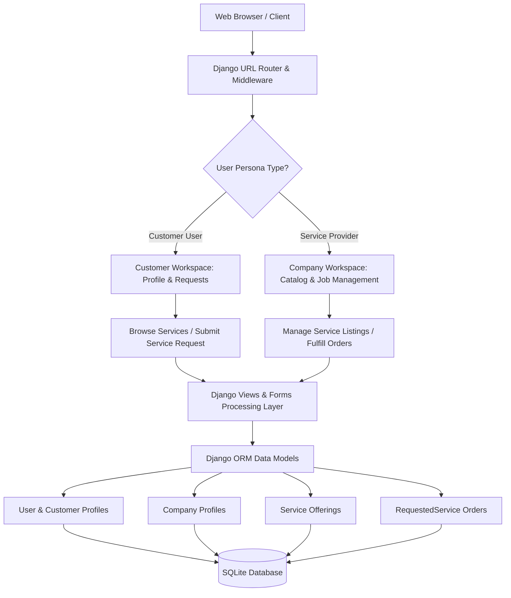
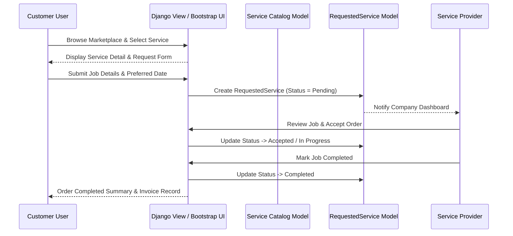

<p align="center">
  
</p>

# 🔧 FixLink

[](https://www.python.org/)
[](https://www.djangoproject.com/)
[](https://getbootstrap.com/)
[](LICENSE.md)

**FixLink** is a full-stack home services marketplace web platform engineered with Python, Django, and Bootstrap. FixLink connects residential and commercial property owners with verified trade service companies (electricians, plumbers, HVAC technicians, general contractors), enabling service catalog management, quote requests, appointment scheduling, and order tracking.

---

## ⚡ Key Highlights

- **Dual Persona Workflows**: Distinct user experiences tailored for **Customer Accounts** (browse services, request quotes, track active orders) and **Service Provider Companies** (manage listings, view job requests, update fulfillment status).
- **Service Catalog Management**: Service providers can post, edit, and categorize home service offerings with pricing metrics and descriptions.
- **Job Request Engine**: Customers can select service providers, submit detailed job specifications, and track order lifecycles (Pending -> Accepted -> In Progress -> Completed).
- **Company Profiles**: Service provider landing pages displaying company contact info, available service categories, ratings, and customer reviews.
- **Relational Data Persistence**: SQLite database schema with ORM relationships binding Customers, Companies, Services, and RequestedService records.

---

## 📋 Table of Contents

- [Key Highlights](#-key-highlights)
- [System Architecture](#-system-architecture)
- [Service Request Sequence Flow](#-service-request-sequence-flow)
- [Setup & Execution](#-setup--execution)
- [Project Directory Structure](#-project-directory-structure)
- [License](#-license)

---

## 🖼️ Application Dashboards

| Customer Workspace | Service Provider Dashboard |
| :---: | :---: |
|  |  |

---

## 🏗️ System Architecture



---

## 📐 Service Request Sequence Flow



---

## 🚀 Setup & Execution

### Prerequisites

- **Python**: 3.9 or newer installed.
- **pip**: Package installer.

---

### Setup & Run

1. **Clone Repository**:
   ```bash
   git clone https://github.com/sahmedhusain/fixlink.git
   cd fixlink
   ```

2. **Setup Virtual Environment**:
   ```bash
   python3 -m venv venv
   source venv/bin/activate
   ```

3. **Install Dependencies**:
   ```bash
   pip install django
   ```

4. **Execute Migrations & Seed Sample Data**:
   ```bash
   python3 manage.py migrate
   python3 seed_data.py
   ```

5. **Start Django Development Server**:
   ```bash
   python3 manage.py runserver
   ```
   *FixLink will run locally at `http://127.0.0.1:8000`.*

---

## 📂 Project Directory Structure

```
fixlink/
├── manage.py              # Django CLI utility
├── seed_data.py           # Database seeding script
├── fixlink/               # Core project configuration
│   ├── settings.py        # Django settings configuration
│   ├── urls.py            # Global URL routing
│   └── wsgi.py            # WSGI application entrypoint
├── main/                  # Core app (authentication & home views)
│   ├── models.py          # User profile models
│   ├── views/             # Authentication & landing page handlers
│   └── templates/         # Base layout templates
├── services/              # Marketplace app (catalog & order fulfillment)
│   ├── models.py          # Service, Company, and RequestedService models
│   ├── views.py           # Service CRUD & order lifecycle handlers
│   └── templates/         # Marketplace & service request templates
└── static/                # Static assets (CSS, JS, images)
```

---

## 📄 License

Distributed under the MIT License. See [LICENSE](LICENSE.md) for details.
